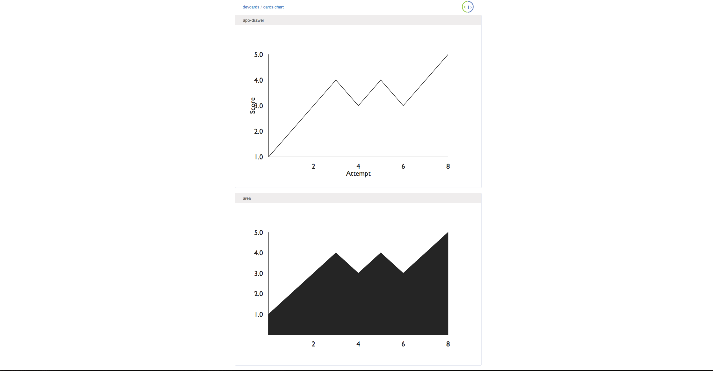

# victory-cljs

ClojureScript wrapper for [Victory Charts](http://formidable.com/open-source/victory/docs/victory-chart/).

## Installation

Include the following in your `project.clj` or `build.boot`:

`[com.kenbier/victory-cljs "0.1.0-SNAPSHOT"]`


## Usage

Here are examples of Line Chart and Area Chart [devcards](https://github.com/bhauman/devcards), using [Rum](https://github.com/tonsky/rum)

``` clojure
(ns cards.chart
  (:require
   [cljsjs.victory]
   [rum.core :as rum :refer [defc defcs]]
   [victory-cljs.core :as victory]
   [sablono.core :as sab]
   [devcards.core :as dc :refer-macros [defcard]]))

(def data [{:score 1}
           {:score 2}
           {:score 3}
           {:score 4}
           {:score 3}
           {:score 4}
           {:score 3}
           {:score 4}
           {:score 5}])

(defc line-chart < [data]
  (victory/victory-chart
   {}
   (victory/victory-axis {:dependent-axis true
                          :label          "Score"})
   (victory/victory-axis {:label "Attempt"})
   (victory/victory-line
    {:y              (fn [datum] (.-score datum))
     :labels         (fn [datum] (.-score datum))
     :labelComponent (victory/victory-tooltip {})
     :data           data})))

(defc area-chart < []
  (victory/victory-chart
   {}
   (victory/victory-area
    {:y    (fn [datum] (.-score datum))
     :data data})))

(defcard app-drawer
  (line-chart data))

(defcard area
  (area-chart))

```



## Contributors
* Karanbir Toor [currentoor](https://github.com/currentoor/)

## License

Copyright © 2017-Present Kenneth Bier 

